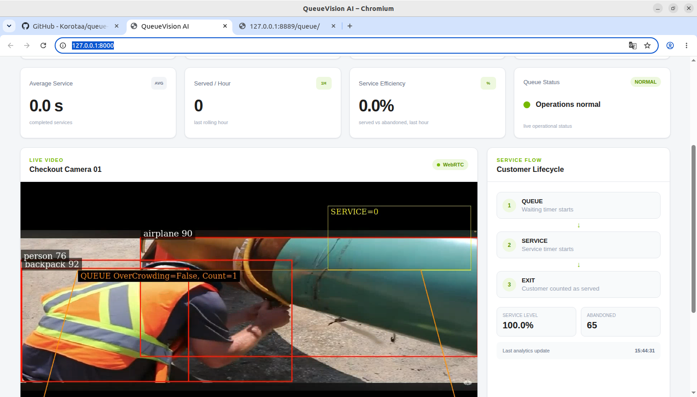
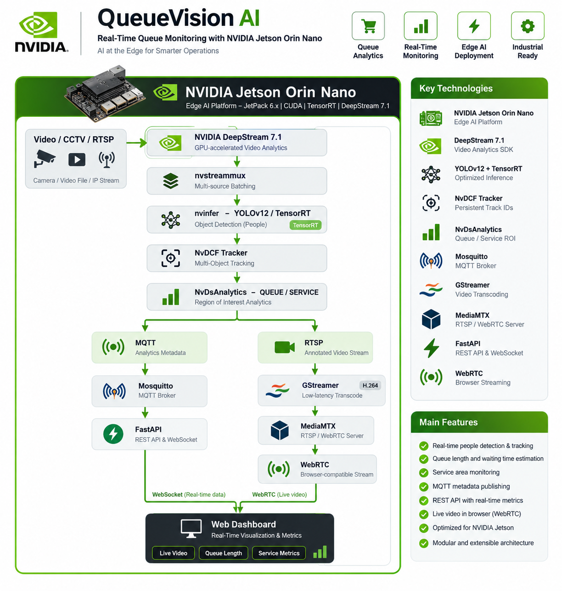
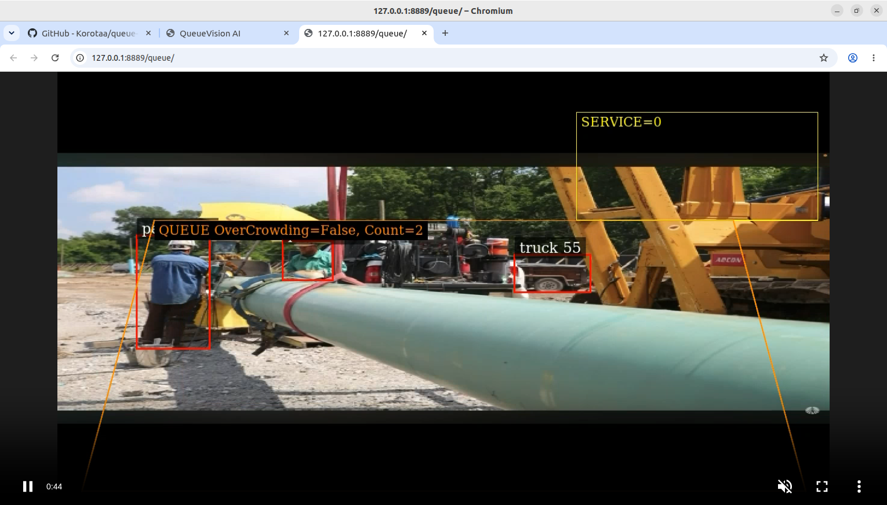
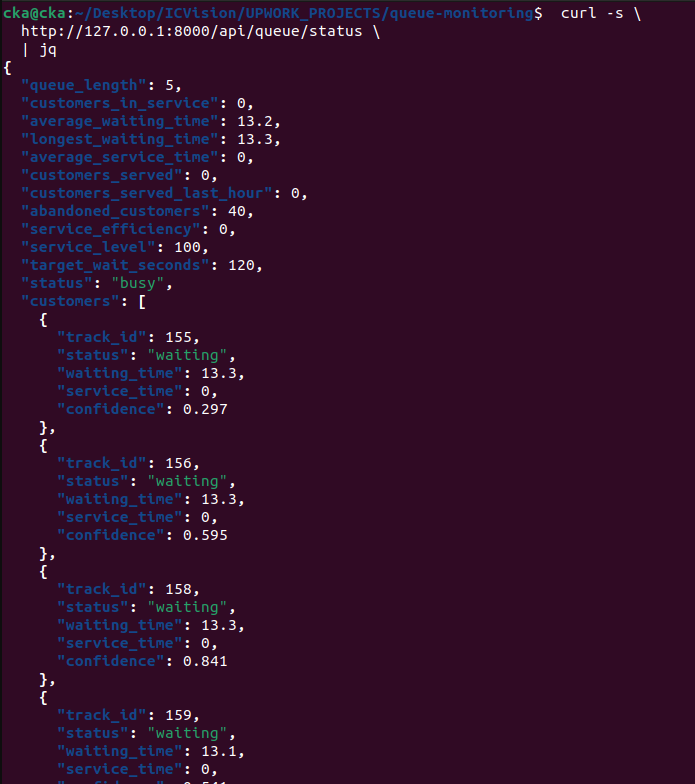
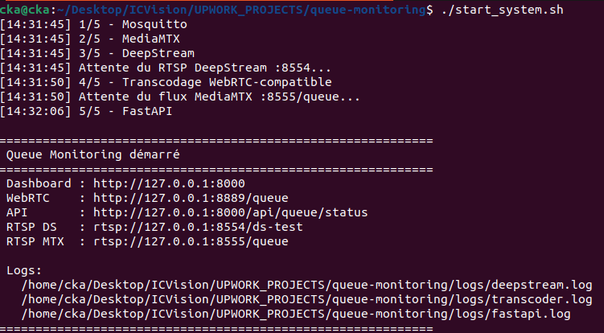
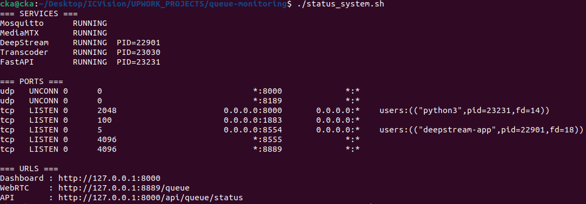
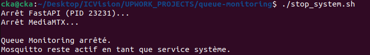

# QueueVision AI — Real-Time Queue Monitoring on NVIDIA Jetson

<p align="center">
  <strong>YOLOv12 · TensorRT · NVIDIA DeepStream 7.1 · NvDCF · NvDsAnalytics · MQTT · FastAPI · MediaMTX · WebRTC</strong>
</p>

<p align="center">
  Real-time retail queue monitoring and service analytics running on NVIDIA Jetson Orin Nano.
</p>

---

## Overview

**QueueVision AI** is an edge computer-vision application designed to monitor customer queues in real time.

The system detects people with **YOLOv12**, performs accelerated inference with **TensorRT / NVIDIA DeepStream**, assigns persistent IDs with **NvDCF Tracker**, evaluates configurable queue/service zones with **NvDsAnalytics**, publishes analytics through **MQTT**, and exposes the results through a **FastAPI dashboard** with low-latency **WebRTC** video.

The same architecture can be adapted to checkout queues, waiting areas, people flow, industrial safety zones, restricted areas, and multi-camera edge analytics.

---


## 🎥 End-to-End Demo

The following technical demonstration shows the complete **QueueVision AI** pipeline running on an NVIDIA Jetson Orin Nano.

> **Note:** the current recording uses construction-site footage to validate the end-to-end technical pipeline: detection, tracking, analytics, messaging, API and browser streaming. A retail checkout scene is recommended for final business-level validation of the `QUEUE → SERVICE → EXIT` workflow.

<p align="center">
  <a href="https://youtu.be/xmGMBkxRDmM?si=J35orEgudlqYvwoR">
    
  </a>
</p>

<p align="center">
  <a href="https://youtu.be/xmGMBkxRDmM?si=J35orEgudlqYvwoR">
    <strong>▶ Watch the End-to-End Demo on YouTube</strong>
  </a>
</p>

**Demonstrated pipeline:**

`Video → YOLOv12 → TensorRT → DeepStream → NvDCF → NvDsAnalytics → MQTT / RTSP → FastAPI / MediaMTX → WebSocket / WebRTC → Dashboard`

---


## Architecture


<p align="center">
  
</p>

---


## 📸 Screenshots

### Real-Time Monitoring Dashboard

<p align="center">
  
</p>

The dashboard combines the annotated live stream with queue length, waiting-time metrics, service state and customer lifecycle information.

### Browser WebRTC Stream

<p align="center">
  
</p>

The DeepStream RTSP output is converted to a browser-compatible H.264 stream and delivered through **MediaMTX / WebRTC**.

### FastAPI Real-Time Metrics

<p align="center">
  
</p>

The backend exposes the current analytics state as structured JSON: queue length, active track IDs, waiting times, service metrics and operational status.

### Automated System Startup

<p align="center">
  
</p>

A single runtime script starts the complete stack in the required order: **Mosquitto → MediaMTX → DeepStream → GStreamer → FastAPI**.

### Runtime Health Check

<p align="center">
  
</p>

The status command verifies the main services, process IDs, ports and application endpoints.

### Controlled Shutdown

<p align="center">
  
</p>

The complete application can be stopped cleanly while leaving Mosquitto available as a system service.


## Features

- YOLOv12 person detection
- TensorRT inference
- NVIDIA DeepStream 7.1
- Custom YOLO C++ parser
- NvDCF multi-object tracking
- Configurable `QUEUE` and `SERVICE` ROIs
- Overcrowding detection
- Queue length and waiting-time metrics
- Customer service-state tracking
- Customers served / abandoned
- Service efficiency
- MQTT metadata publishing
- FastAPI REST API
- WebSocket live metrics
- Low-latency WebRTC video
- Modern light dashboard
- Start / stop / status automation scripts

---

## Tested Environment

| Component | Configuration |
|---|---|
| Device | NVIDIA Jetson Orin Nano 8 GB |
| JetPack | 6.x |
| DeepStream | 7.1 |
| TensorRT | 10.7 |
| OS | Ubuntu / L4T R36 |
| Python | 3.10 |
| Model | YOLOv12 |
| Browser video | WebRTC |

---

## Technology Stack

**Vision**

```text
YOLOv12
TensorRT
NVIDIA DeepStream
NvDCF Tracker
NvDsAnalytics
NvDsOSD
```

**Backend & Messaging**

```text
Mosquitto MQTT
FastAPI
WebSocket
Python
```

**Video Streaming**

```text
DeepStream RTSP
GStreamer
x264 low-latency encoding
MediaMTX
WebRTC
```

---

## Project Structure

```text
queue-monitoring/
│
├── models/
│   └── yolo12s_ds_trt107.engine
│
├── videos/
│   └── test.mov
│
├── configs/
│   ├── deepstream_queue.txt
│   ├── config_infer_yolov12.txt
│   ├── config_nvdsanalytics.txt
│   ├── config_tracker.txt
│   ├── cfg_mqtt.txt
│   ├── msgconv_yolov12.txt
│   └── labels.txt
│
├── deepstream/
│   ├── parser/
│   │   ├── nvdsinfer_yolov12_parser.cpp
│   │   └── libnvdsinfer_yolov12.so
│   └── msgconv/
│       ├── custom_msg2p.cpp
│       └── libnvds_msgconv_queue.so
│
├── backend/
│   ├── app/
│   │   ├── main.py
│   │   ├── mqtt/
│   │   ├── queue/
│   │   ├── api/
│   │   └── websocket/
│   ├── static/
│   │   ├── index.html
│   │   ├── app.js
│   │   └── style.css
│   └── requirements.txt
│
├── logs/
├── mqtt_debug/
├── tests/
├── start_system.sh
├── stop_system.sh
├── status_system.sh
└── README.md
```

---

## DeepStream Pipeline

```text
source
  ↓
nvstreammux
  ↓
nvinfer
  ↓
nvtracker
  ↓
nvdsanalytics
  ↓
nvdsosd
  ↓
tee
 ├─────────────► RTSP
 └─────────────► MQTT
```

---

## YOLOv12 TensorRT Model

The deployed TensorRT engine uses:

```text
Input
name  : images
shape : (1, 3, 640, 640)
dtype : FLOAT

Output
name  : output0
shape : (1, 84, 8400)
dtype : FLOAT
```

The output layout is interpreted as:

```text
84 channels
├── 4 bbox values: cx, cy, width, height
└── 80 class scores
```

A custom DeepStream parser converts raw predictions to `NvDsInferObjectDetectionInfo`.

---

## Compile the YOLO Parser

```bash
cd deepstream/parser

g++ -std=c++17 \
  -Wall \
  -Wextra \
  -fPIC \
  -shared \
  nvdsinfer_yolov12_parser.cpp \
  -I/opt/nvidia/deepstream/deepstream-7.1/sources/includes \
  -I/usr/local/cuda/include \
  -o libnvdsinfer_yolov12.so
```

---

## Primary Inference Configuration

Example:

```ini
[property]
gpu-id=0
model-engine-file=/absolute/path/models/yolo12s_ds_trt107.engine
labelfile-path=/absolute/path/configs/labels.txt
num-detected-classes=80
batch-size=1
network-type=0
gie-unique-id=1
interval=0
net-scale-factor=0.00392156862745098
model-color-format=0
maintain-aspect-ratio=1
symmetric-padding=1
output-blob-names=output0
parse-bbox-func-name=NvDsInferParseCustomYoloV12
custom-lib-path=/absolute/path/deepstream/parser/libnvdsinfer_yolov12.so
cluster-mode=2

[class-attrs-all]
pre-cluster-threshold=0.25
nms-iou-threshold=0.45
topk=300
```

> Replace absolute paths with paths matching your own installation.

---

## Tracking

The project uses **NvDCF Tracker**.

```ini
[tracker]
enable=1
tracker-width=640
tracker-height=640
ll-lib-file=/opt/nvidia/deepstream/deepstream-7.1/lib/libnvds_nvmultiobjecttracker.so
ll-config-file=/opt/nvidia/deepstream/deepstream-7.1/samples/configs/deepstream-app/config_tracker_NvDCF_perf.yml
enable-batch-process=1
enable-past-frame=0
display-tracking-id=1
```

Tracking provides persistent IDs used to estimate customer waiting and service time.

---

## Queue Analytics

Example ROI configuration:

```ini
[property]
enable=1
config-width=640
config-height=640
osd-mode=2
display-font-size=16

[roi-filtering-stream-0]
enable=1
class-id=0
inverse-roi=0
roi-QUEUE=80;220;560;220;620;620;20;620
roi-SERVICE=430;60;630;60;630;220;430;220
```

`class-id=0` corresponds to the COCO `person` class.

> ROI coordinates must be adapted to the real camera view.

---

## Customer Lifecycle

```text
Detected in QUEUE
      ↓
   WAITING
      ↓
Same track_id reaches SERVICE
      ↓
   SERVING
      ↓
Leaves service area
      ↓
    SERVED
```

A customer whose track disappears without reaching `SERVICE` can be classified as `ABANDONED` after the configured timeout.

---

## MQTT Metadata

Topic:

```text
deepstream/queue-monitoring
```

Example payload:

```json
{
  "camera_id": "cam_0",
  "source_id": 0,
  "frame_id": 3452,
  "queue_count": 3,
  "detections": [
    {
      "track_id": 156,
      "class_id": 0,
      "class_name": "person",
      "confidence": 0.728,
      "tracker_confidence": 0.644,
      "bbox": {
        "x": 142.3,
        "y": 220.5,
        "width": 92.4,
        "height": 210.1
      },
      "in_queue": true,
      "roi": ["QUEUE"]
    }
  ]
}
```

Test MQTT:

```bash
mosquitto_sub \
  -h 127.0.0.1 \
  -p 1883 \
  -t "deepstream/queue-monitoring" \
  | jq --unbuffered .
```

---

## Compile the Custom Message Converter

```bash
cd deepstream/msgconv

g++ -std=c++17 \
  -Wall \
  -Wextra \
  -fPIC \
  -shared \
  custom_msg2p.cpp \
  -I/opt/nvidia/deepstream/deepstream-7.1/sources/includes \
  -I/opt/nvidia/deepstream/deepstream-7.1/sources/libs/nvmsgconv \
  $(pkg-config --cflags --libs gstreamer-1.0 glib-2.0) \
  -pthread \
  -o libnvds_msgconv_queue.so
```

---

## Low-Latency Browser Video

DeepStream provides:

```text
rtsp://127.0.0.1:8554/ds-test
```

The browser-compatible video path used in this project is:

```text
DeepStream RTSP
      ↓
nvv4l2decoder
      ↓
nvvideoconvert
      ↓
x264enc
      ↓
H.264 Baseline / B-frames = 0
      ↓
MediaMTX
      ↓
WebRTC
```

Example bridge:

```bash
gst-launch-1.0 -e \
  rtspsrc \
    location=rtsp://127.0.0.1:8554/ds-test \
    protocols=tcp \
    latency=30 \
  ! rtph264depay \
  ! h264parse \
  ! nvv4l2decoder \
  ! nvvideoconvert \
  ! 'video/x-raw,format=I420' \
  ! x264enc \
      tune=zerolatency \
      speed-preset=ultrafast \
      bitrate=4000 \
      key-int-max=15 \
      bframes=0 \
      byte-stream=true \
      cabac=false \
  ! 'video/x-h264,profile=baseline' \
  ! h264parse config-interval=-1 \
  ! rtspclientsink \
      location=rtsp://127.0.0.1:8555/queue \
      protocols=tcp
```

WebRTC endpoint:

```text
http://127.0.0.1:8889/queue
```

---

## FastAPI Backend

Install dependencies:

```bash
cd backend
python3 -m pip install --user -r requirements.txt
```

Manual launch:

```bash
python3 -m uvicorn app.main:app \
  --host 0.0.0.0 \
  --port 8000
```

---

## REST API

Endpoint:

```text
GET /api/queue/status
```

Test:

```bash
curl -s http://127.0.0.1:8000/api/queue/status | jq
```

Example response:

```json
{
  "queue_length": 3,
  "customers_in_service": 1,
  "average_waiting_time": 24.2,
  "longest_waiting_time": 51.8,
  "average_service_time": 32.4,
  "customers_served": 12,
  "customers_served_last_hour": 7,
  "abandoned_customers": 1,
  "service_efficiency": 87.5,
  "service_level": 85.7,
  "status": "busy"
}
```

---

## Dashboard

Open:

```text
http://127.0.0.1:8000
```

The dashboard includes:

- Queue Length
- Average Wait
- Longest Wait
- Customers In Service
- Average Service Time
- Customers Served / Hour
- Service Efficiency
- Service Level
- Active Customers
- Live WebRTC Feed

---

## Start the Complete System

Make scripts executable once:

```bash
chmod +x start_system.sh stop_system.sh status_system.sh
```

Start:

```bash
./start_system.sh
```

Startup order:

```text
Mosquitto
   ↓
MediaMTX
   ↓
DeepStream
   ↓
GStreamer transcoder
   ↓
FastAPI
```

---

## Check System Status

```bash
./status_system.sh
```

Expected:

```text
Mosquitto      RUNNING
MediaMTX       RUNNING
DeepStream     RUNNING
Transcoder     RUNNING
FastAPI        RUNNING
```

### Important Ports

| Port | Service |
|---:|---|
| `1883` | Mosquitto MQTT |
| `8000` | FastAPI dashboard/API |
| `8554` | DeepStream RTSP |
| `8555` | MediaMTX RTSP |
| `8889` | MediaMTX WebRTC HTTP |
| `8189/UDP` | WebRTC ICE |

---

## Stop the System

```bash
./stop_system.sh
```

---

## Diagnostics

### DeepStream

```bash
deepstream-app --version
pgrep -af deepstream-app
```

### GStreamer

```bash
gst-inspect-1.0 nvinfer
gst-inspect-1.0 nvtracker
gst-inspect-1.0 nvdsosd
gst-inspect-1.0 nvv4l2decoder
gst-inspect-1.0 x264enc
gst-inspect-1.0 rtspclientsink
```

### RTSP

```bash
ffplay -rtsp_transport tcp rtsp://127.0.0.1:8554/ds-test
```

### Inspect Browser-Compatible H.264

```bash
ffprobe \
  -v error \
  -rtsp_transport tcp \
  -select_streams v:0 \
  -show_entries stream=codec_name,profile,has_b_frames,width,height,r_frame_rate \
  -of default=noprint_wrappers=1 \
  rtsp://127.0.0.1:8555/queue
```

Expected key values:

```text
codec_name=h264
profile=Constrained Baseline
has_b_frames=0
```

### MediaMTX

```bash
docker logs -f mediamtx
```

### MQTT

```bash
mosquitto_sub \
  -h 127.0.0.1 \
  -p 1883 \
  -t "deepstream/queue-monitoring" \
  | jq --unbuffered .
```

### Ports

```bash
ss -ltnup | grep -E '1883|8000|8554|8555|8889|8189'
```

---

## Common Issues

### RTSP Works in VLC but Not in Browser

A valid RTSP stream is not necessarily WebRTC-compatible.

Typical incompatible output:

```text
H.264 High Profile
B-frames > 0
```

The project solves this with a low-latency GStreamer branch producing:

```text
H.264 Baseline
B-frames = 0
```

### `non-existing PPS 0 referenced`

The decoder did not receive the expected H.264 parameter sets. Check SPS/PPS insertion, IDR cadence, and `h264parse` configuration.

### MediaMTX `connection refused`

Verify that DeepStream is already exposing RTSP:

```bash
ss -ltnp | grep 8554
```

### No MQTT Messages

```bash
systemctl status mosquitto
```

Then subscribe manually to the topic.

### No `SERVICE` Events

Verify the `SERVICE` ROI and ensure it matches the real path followed by the tracked person.

---


## Repository

```text
github.com/Korotaa/queue-monitoring
```

---

## Author

**Korota Arsène Coulibaly**  
Embedded Systems · Edge AI · Computer Vision · NVIDIA Jetson · DeepStream

---


## License

 `Apache-2.0`

---

<p align="center">
  <strong>Built for real-time Edge AI on NVIDIA Jetson.</strong>
</p>
